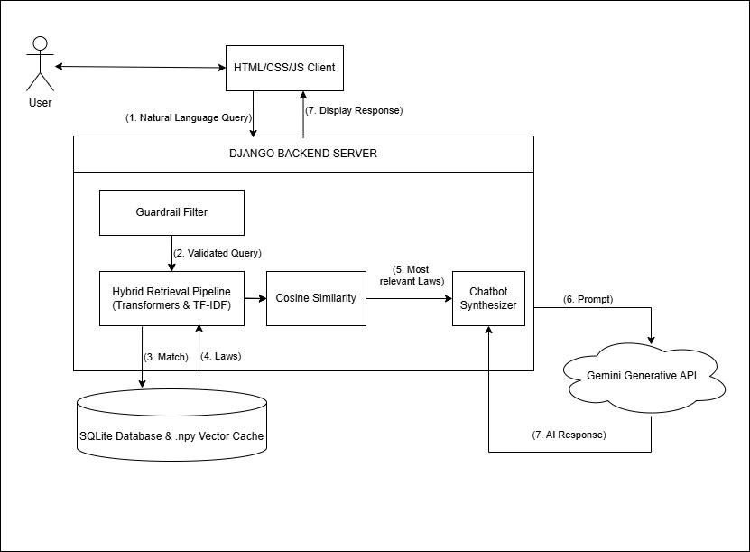

# ⚖️ LegalBot India: Hybrid RAG AI Legal Assistant


LegalBot India is an enterprise-grade AI web application that translates complex Indian legal texts into accessible, plain-English summaries. Built on a highly scalable **Hybrid Retrieval-Augmented Generation (RAG)** architecture, it allows citizens to search for relevant laws using natural language without the risk of AI hallucination.

## 📖 About The Project

Traditional legal databases require exact keyword knowledge, while generic Large Language Models (LLMs) frequently hallucinate fake laws. LegalBot India bridges this gap. 

By mapping over 34,000 Indian statutory records (including the transition from legacy IPC/CrPC to modern BNS/BNSS codes), this system fuses dense semantic understanding with precise lexical matching. It restricts the LLM from relying on its own memory, forcing it to generate answers grounded *strictly* in the retrieved, verified legal text.

### ✨ Key Features
* **Zero-Hallucination Guardrails:** Enforces a strict `0.35` mathematical cosine similarity threshold. If a query falls below this confidence score, the system gracefully rejects it rather than guessing.
* **O(1) Lexical Bouncers:** Implements instantaneous input validation to block prompt injection (jailbreaking) and non-relevant queries before they consume expensive AI compute time.
* **Integrated Advocate Directory:** A UI module that connects users with verified human legal counsel based on practice area, ensuring the tool remains educational and not an advisory substitute.
* **Lightning Fast Retrieval:** Utilizes a local `.npy` vector cache to load the 384-dimensional dataset into memory, achieving an average retrieval latency of just `0.27 seconds`.

---

## 📸 Project Demonstration

### System Architecture
> *The Hybrid RAG pipeline fusing semantic vectors with lexical guardrails.*


### Live Demo
> *Watch LegalBot India translate natural language into verified legal statutes.*

[**🎥 Click here to watch the Live Demo Video!**](https://github.com/RittuSoney/LegalBotIndia/blob/main/assets/Video%20Project%201.mp4)

<video src="https://github.com/RittuSoney/LegalBotIndia/raw/main/assets/Video%20Project%201.mp4" controls="controls" style="max-width: 100%;">
</video>

### 1. The Chat Interface
> *Translating natural language problems into specific, verified Indian statutes.*
![Chat Interface]

### 2. The Advocate Directory
> *Connecting users with specialized human counsel for actionable legal steps.*
![Advocate Directory]

---

## 🧠 The Architecture (Hybrid RAG)

The core engine relies on a weighted fusion of two independent search methodologies to guarantee accuracy:

1. **Semantic Search (70% Weight):** Uses the `all-MiniLM-L6-v2` Sentence Transformer to convert the user's query into a 384-dimensional vector, matching the *meaning* and *intent* of the question against the dataset.
2. **Lexical Search (30% Weight):** Uses Scikit-Learn's `TfidfVectorizer` to perform sparse matrix keyword matching, ensuring that exact section numbers or specific legal terminology are prioritized.
3. **Generative Layer:** The top 5 highest-scoring contexts are passed securely to the **Google Gemini 2.0 Flash Lite API** to generate a plain-English, educational summary.

---

## 🌍 Cross-Industry Adaptability (Beyond Law)

While this specific instance is deployed for the Indian Legal Domain, **the underlying Hybrid RAG architecture is entirely domain-agnostic.** The system relies on the mathematical structure of the data, not the subject matter. By simply replacing the core `CSV` dataset and regenerating the local `.npy` vector cache, this exact codebase can instantly be transformed into:

* 🏥 **A Medical Diagnostic Assistant:** Grounded in medical journals and pharmaceutical guidelines to assist clinical triage.
* 🏢 **An Enterprise HR Bot:** Grounded in internal corporate policies, compliance documents, and employee handbooks.
* 🎓 **An Academic Research Tool:** Grounded in university thesis archives for semantic literature reviews.

This modularity provides a universal blueprint for deploying safe, hallucination-free AI in any mission-critical, data-sensitive industry.

---

## 🛠️ Built With

* **Backend:** Python, Django, Django REST Framework
* **AI/ML:** Sentence Transformers (`all-MiniLM-L6-v2`), Scikit-Learn, Google GenAI SDK
* **Database & Caching:** SQLite, Local `.npy` Vector Caching
* **Frontend:** HTML5, CSS3, Vanilla JavaScript

---

## 🚀 Getting Started

### Prerequisites
* Python 3.10+
* A Google Gemini API Key

### Installation

1. Clone the repository:
   ```bash
   git clone [https://github.com/RittuSoney/LegalBotIndia.git](https://github.com/RittuSoney/LegalBotIndia.git)
   cd LegalBotIndia